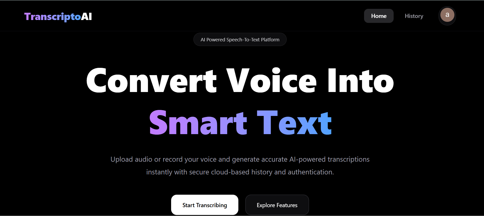
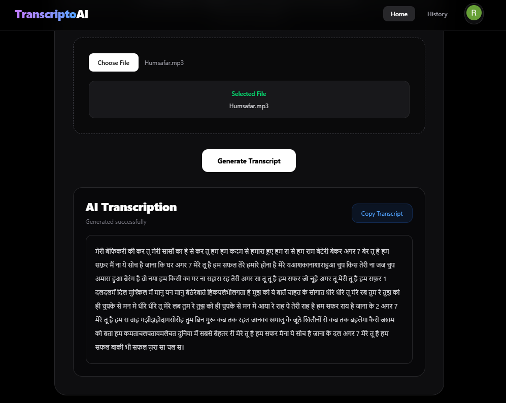
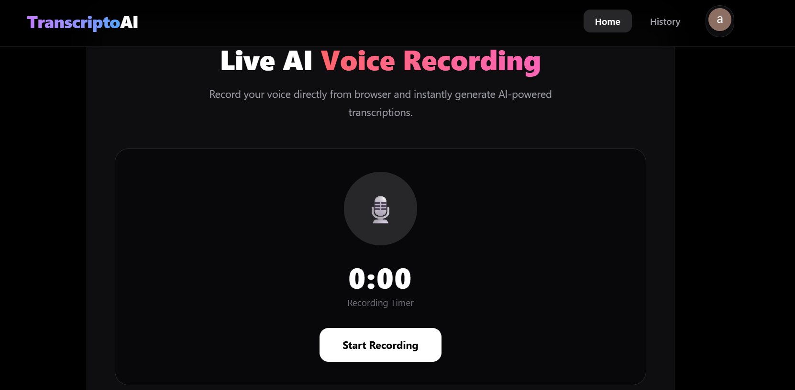
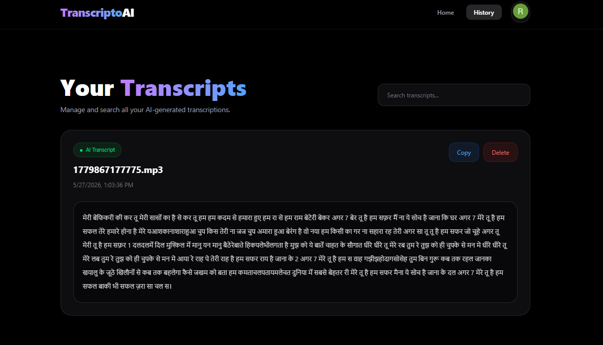
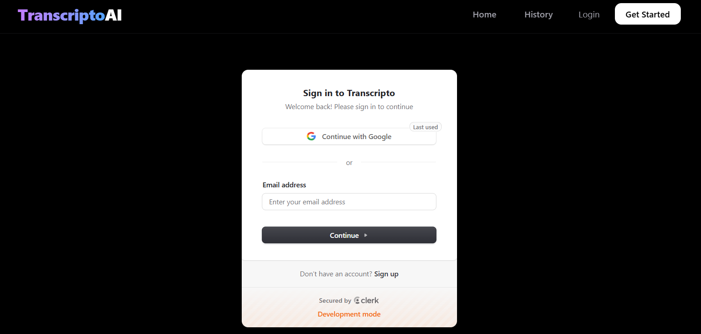
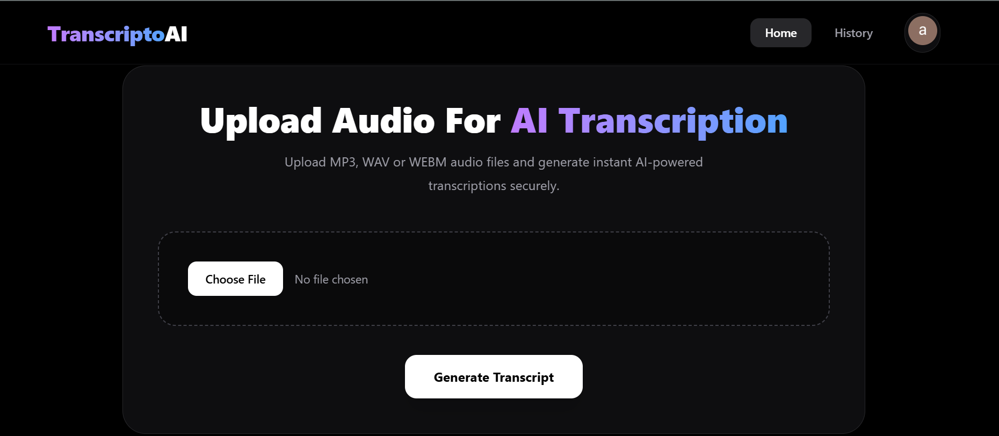

# 🎙️ Transcripto AI

⭐ If you like this project, give it a star on GitHub!


---

# 🚀 About The Project

Transcripto AI is a full-stack AI-powered speech-to-text SaaS application that allows users to upload audio files or record live voice directly from the browser and generate accurate transcriptions using AssemblyAI. The platform includes secure authentication, transcript history management, and a modern responsive UI.

---

# 🌐 Live Demo

## Frontend
https://transcripto-silk.vercel.app

## Backend
https://transcripto-backend-h9e7.onrender.com

---

# ✨ Features

- 🎵 Upload audio files
- 🎙️ Live voice recording
- 🤖 AI-powered transcription
- 🔐 Clerk authentication
- 📂 User-specific transcript history
- 📋 Copy transcript feature
- 🗑️ Delete transcript feature
- ⚡ Fast and responsive UI
- 🌑 Premium dark SaaS interface
- ☁️ Cloud deployment

---

# 🛠️ Tech Stack

## Frontend
- React.js
- Vite
- Tailwind CSS
- Clerk Authentication
- Axios

## Backend
- Node.js
- Express.js
- MongoDB Atlas
- Mongoose
- Multer
- AssemblyAI API

## Deployment
- Vercel (Frontend)
- Render (Backend)
- MongoDB Atlas (Database)

---

# 🧠 Application Architecture

```text
Frontend (React + Vite)
        ↓
Axios API Calls
        ↓
Backend (Express.js)
        ↓
AssemblyAI API
        ↓
MongoDB Atlas Database
```

---

# 📸 Screenshots

## Home Page


---

## Upload Transcription


---

## Live Recording


---

## History Dashboard


---

## Sign In Page


---

## Upload Page


---

# ⚙️ Installation

## Clone Repository

```bash
git clone https://github.com/abhicse12/transcripto-ai.git
```

---

# Frontend Setup

```bash
npm install
npm run dev
```

---

# Backend Setup

```bash
cd server

npm install

npm run dev
```

---

# 🔑 Environment Variables

## Frontend `.env`

```env
VITE_CLERK_PUBLISHABLE_KEY=your_key
```

---

## Backend `.env`

```env
MONGO_URI=your_mongodb_uri

ASSEMBLYAI_API_KEY=your_api_key
```

---

# 📂 Folder Structure

```bash
Transcripto/
│
├── src/
│   ├── api/
│   ├── components/
│   ├── pages/
│   ├── App.jsx
│   └── main.jsx
│
├── public/
│
├── screenshots/
│
├── server/
│   ├── config/
│   ├── controllers/
│   ├── middleware/
│   ├── models/
│   ├── routes/
│   ├── uploads/
│   └── server.js
│
├── .gitignore
├── package.json
└── README.md
```

---

# 🔥 Core Functionalities

## 🎵 Audio Upload
Users can upload MP3, WAV, and WEBM files for AI transcription.

## 🎙️ Live Recording
Users can record voice directly from the browser using the MediaRecorder API.

## 🤖 AI Transcription
AssemblyAI converts speech into accurate text transcriptions using AI-powered speech recognition.

## 🔐 Authentication
Clerk authentication secures user accounts and protects private routes.

## 📂 Transcript History
Users can manage, search, copy, and delete previous transcriptions.

---

# 🌐 Deployment

## Frontend
Deployed on Vercel.

## Backend
Deployed on Render.

## Database
MongoDB Atlas cloud database.

---

# 🚀 Future Improvements

- 📄 Download transcript feature
- 🧠 AI transcript summarization
- 🌍 Multi-language transcription
- ⚡ Real-time speech streaming
- ☁️ Cloud audio storage
- 📱 Mobile app support

---

# 👨‍💻 Author

## Abhishek Pandey

B.Tech 4th Year Student  
Full Stack Developer | MERN Stack | AI Projects

- GitHub: https://github.com/abhicse12

---

# 📜 License

This project is for educational and portfolio purposes.